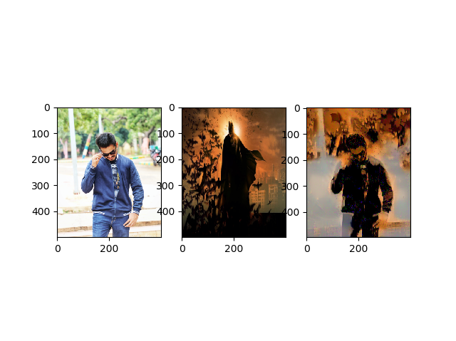

# Implementing-Neural-Style-Transfer
This is a Python implementation of Neural Style Transfer using Torch and Pillow.

#### Output:

## Installation of Model:
* Install Torch and Pillow.
* Run nst.py

## Original Paper
* A Neural Algorithm of Artistic Style
Leon A. Gatys,1,2,3∗ Alexander S. Ecker,1,2,4,5 Matthias Bethge1,2,4
https://arxiv.org/abs/1508.06576

